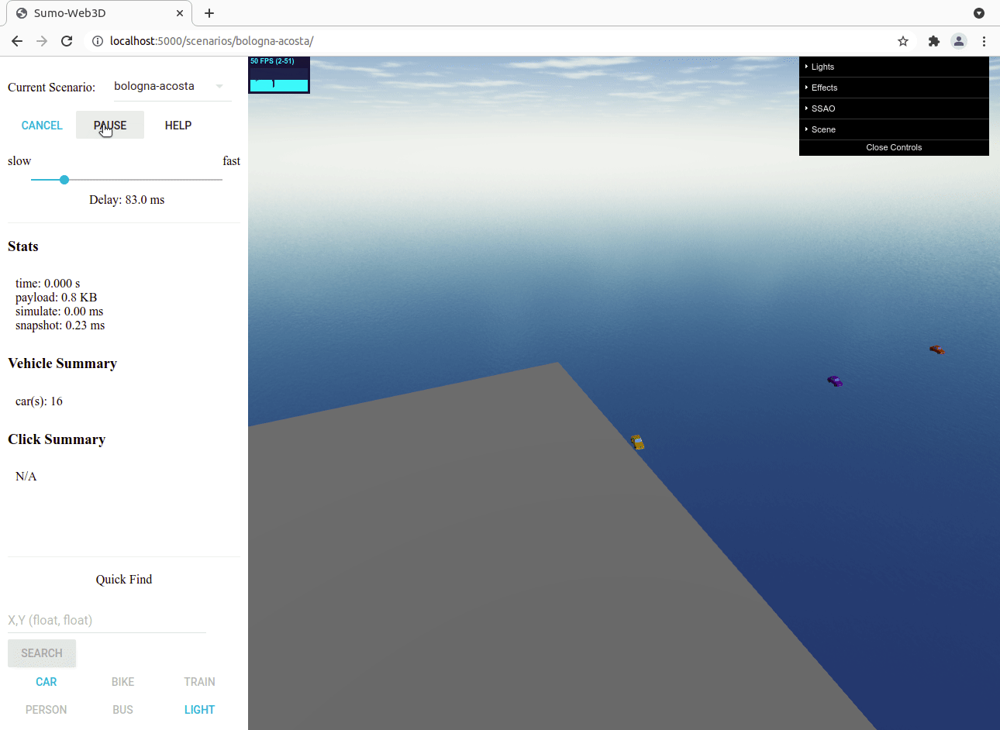
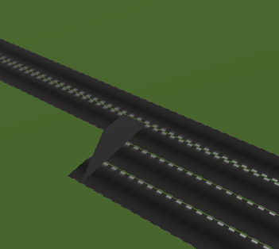
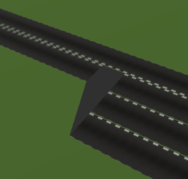
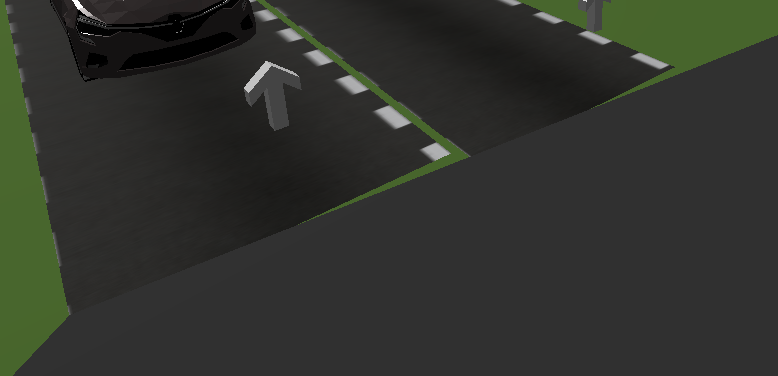

## Scenarios

Use the graphical [`netedit`](https://sumo.dlr.de/docs/Netedit/index.html) tool to create a traffic network `simple.net.xml` and a demand file `simple.rou.xml`.
The [Hello World](https://sumo.dlr.de/docs/Tutorials/Hello_World.html) tutorial on the SUMO website includes a description to create a simple network.
It also shows how to open `sumo-gui` from `netedit` to create the configuration file `simple.sumocfg`.

After you have verified that the simulation runs in `sumo-gui`, use the command `sumo -c simple.sumocfg --fcd-output fcd.xml` to create a floating car data export, see [FCDOutput](https://sumo.dlr.de/docs/Simulation/Output/FCDOutput.html).

Configuration files for a specific scenario are kept in a separate folder like `sumo_web3d/scenarios/simple-crossing/`.
These files must be referenced appropriately in the `./sumo_web3d/scenarios.json` file.
To include our newly created example, add the following entry:
```
    {
        "name": "simple-crossing",
        "description": "Simple crossing with traffic lights",
        "config_file": "scenarios/simple-crossing/simple.sumocfg",
        "fcd_file": "scenarios/simple-crossing/fcd.xml"
    }
```
Note that json does not allow trailing commas.

A recorded simulation is provided via the `fcd_file` attribute.
When this attribute is not present, the SUMO simulator will be started in the background and visualized.

We can now test our new example by starting the server with
```
python sumo_web3d.py
```
and navigating to `http:localhost:5000/simple-crossing/` (note trailing slash).

## Timing

As described in the [SUMO documenation](https://sumo.dlr.de/docs/Simulation/Basic_Definition.html#defining_the_time_step_length), the default time step is 1 second.
The visualization may become smoother when a smaller time step is being used.
When the simulation is live, we can for example provide SUMO with `--step-lenght 0.01` as argument.
This may also be done when recording a simulation to a fcd file.

## Offline running of recorded simulation
Currently, we start SUMO even if we are playing a prerecorded simulation and we use `traci.simulation.getCurrentTime()` while creating the snapshot.
This is not necessary, because the timing is already handled in the Python script itself.

Demo of parsing:



## Traffic light exporting

However, SUMO supports several modes of actuated traffic lights, as described in [Traffic Lights](https://sumo.dlr.de/docs/Simulation/Output/FCDOutput.html).

When controlling the traffic lights via Traci, we could keep track of the states ourselves in a separate XML file.


# Visualization

The default SUMO config files support polygons and points of interest (POIs), see [Shapes](https://sumo.dlr.de/docs/Simulation/Shapes.html).
Simply [using the netedit tool](https://sumo.dlr.de/docs/Netedit/elementsShape.html) allows one to draw polygons that represent buildings or lakes, for example.
It is also possible to import these features from external sources such as OpenStreetMap.

## Polyline

The `lineString()` functions takes a number of points and connects them with a triangulated mesh to represent roads.
It uses the [extrude-polyline](https://github.com/mattdesl/extrude-polyline) package.
The `join` and `cap` parameters can be used to control the appearance of the created polyline.

For example, `cap='square'` gives:



Compare this to `cap='butt'`, which gives:



However, it may also produce situations like:


